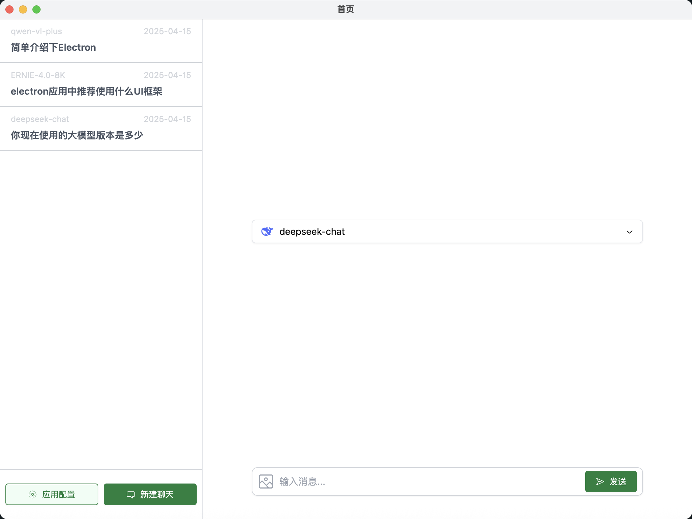

# Electron + Vue + TS + 大模型 跨平台桌面聊天应用

## 应用截图

## 框架搭建

1. Electron Forge 创建项目

    `npm init electron-app@latest my-app -- --template=vite-typescript`
    Electron forge 命令创建项目时 electron 等一些依赖包安装失败，可能是脚手架内部使用的 npm地址和淘宝镜像地址不同导致其内部使用 yarn install 下载失败，可尝试取消 .npmrc 中淘宝镜像配置或创建失败后手动在 package.json 中添加上下载失败的依赖包后重新下载

    *注意： Electron Forge 版本更新较快，如果配置文件或目录结构不同，参考文档在响应地方进行配置即可

2. 添加 Vue3 支持

    1. 根据 Electron Forge 文档，安装 vue 和 @vitejs/plugin-vue 依赖
    2. vite.renderer.config.ts 中添加 @vitejs/plugin-vue 插件，让 vite 支持编译 vue 文件
    3. src/renderer.ts 渲染进程入口文件中引入 vue 并创建 vue 实例
    4. 创建 src/App.vue 文件，并写入测试模板
    5. index.html 文件修改为挂在 vue 实例的容器
    
    *注意：
    1. Electron Forge 创建的项目中 ESLint 配置如果解析不了 vue 等文件，请自行配置
    2. 项目只使用 ESLint 进行格式校验和格式化，关闭了 prettier，如有需要自行配置
    
3. 添加 Tailwind CSS 支持
    1. 安装依赖：npm install -D tailwindcss postcss autoprefixer
    2. 初始配置：npx tailwindcss init -p
    3. 后续根据官方文档或自定义配置即可，建议安装 vscode 插件 Tailwind CSS IntelliSense

4. 添加 Iconify 图标
    1. npm install --save-dev @iconify/vue
    2. 具体使用方式参考官方文档

5. 支持 Radix Vue 组件库
    1. 核心理念：专注构建无侵入性 UI 组件的库，尽可能减少对应用层样式和布局的干扰，提供高度可访问性和灵活性的 UI 组件。
    2. 安装依赖：npm add radix-vue
    
    *注意：使用其他 UI 库，自行配置
    
6. 支持 Vue Router、IndexedDB、Pinia、unplugin-auto-import 依赖的自动导入、ESLint、mockjs
   支持 markdown 高亮

## 多模型集成和使用

1. 使用百度智能云的 ERNIE 相关免费模型进行调试，具体参考官方文档
2. 使用阿里云灵积的通义千问进行调试，具体参考官方文档
